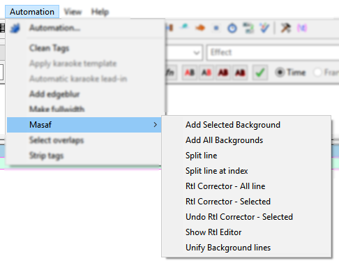
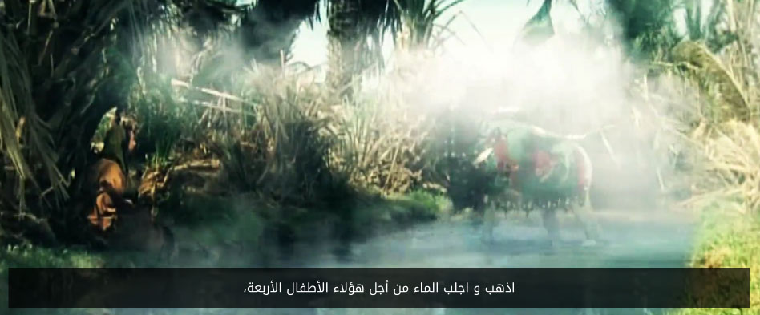
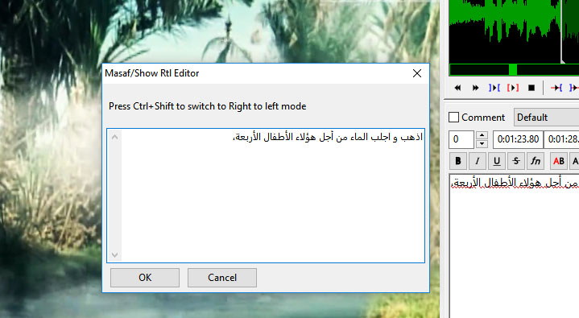

# MasafAutomation
Some Aegisub automation scripts specially designed for Right-To-Left language subtitles

## Scripts:
* Add Selected Background
* Add All Backgrounds
* Split line
* Split line at Index
* Rtl Correction - All line
* Rtl Correction - Selected
* Undo Rtl Correction - Selected
* Show Rtl Editor
* Unify Background lines
* Add Code to Selected lines
* Remove line Breaks

## Screenshots:

Teransparent background for subtitle

RTL editor

