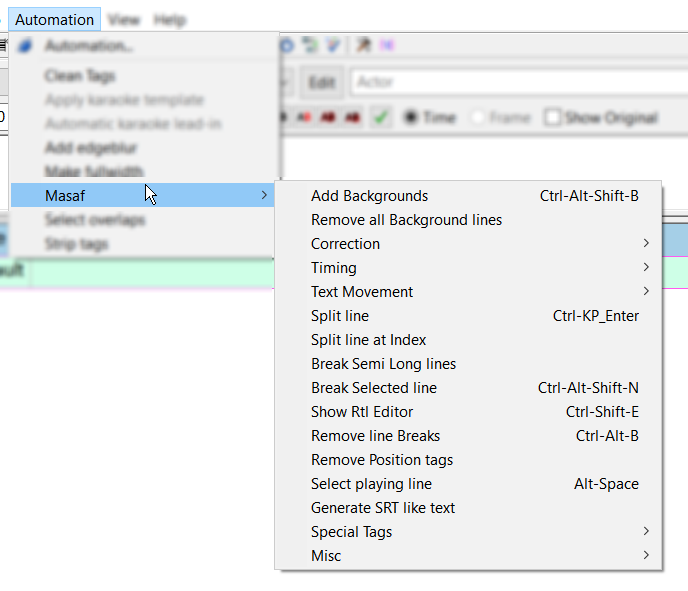

# MasafAutomation

Some Aegisub automation scripts specially designed for Right-To-Left language subtitles

## Scripts:

- Add Backgrounds
- Remove all Background lines
- Rtl Correction - All lines
- Rtl Correction - Selected
- Rtl Correction without normalize
- Add RLE - Selected lines
- Undo Rtl Correction - Selected
- Numbers to English
- Numbers to Arabic
- Numbers to Persian
- Selected Numbers to English
- Selected Numbers to Arabic
- Selected Numbers to Persian
- Shift start line forward
- Shift start line backward
- Shift end line forward
- Shift end line backward
- Make next line continuous
- Make Same time
- Make Same Start time
- Make Same End time
- Move last text part
- Move first part of next
- Move last word
- Move first word of next
- Shift Linebreak
- Shift Linebreak Back
- Split line
- Split line at Index
- Break Semi Long lines
- Break Selected line
- Show Rtl Editor
- Remove line Breaks
- Remove Position tags
- Select playing line
- Fix line Position
- Set line as No Background
- Set line as Don't Correct RTL
- Set line as Don't Remove
- Generate SRT like text
- Unify Background lines
- Add Code to Selected lines
- Import text to selected Lines
- Display sum of times
- Go to line

## Screenshots:

Transparent background for subtitle

RTL editor

